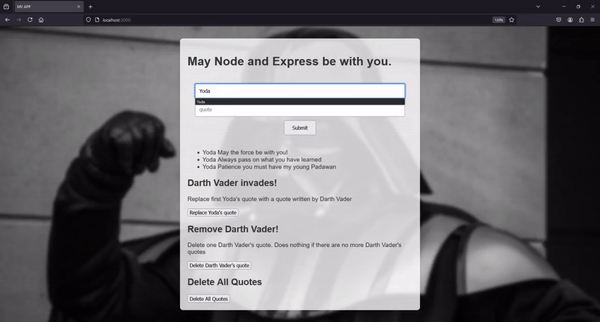

<!-- 
Colours: 
%23007BFF - blue
%236F42C1 - purple
-->

<!--    -->
  
  
<!--    -->
<!--    -->

I'm a creative full stack software engineer with a strong passion for building web applications and a deep interest in artificial intelligence. 

<h1 align="center">Projects:</h1>

<table bordercolor="#66b2b2">
  <!--
  <tr>
    <td width="50%" valign="top">
      <h3 align="center">Hair Salon - Landing page</h3>
         
        
         
        

          --><!--
    
  
      

        
<strong>Javascript, Bootstrap, Sass, Node.js, & Express.js</strong> - Platform to help build momentous milestones along with your friends and family! Travelara makes Dream Trips a Reality!

    </td>
    <td width="50%" valign="top">
      <h3 align="center">Rigley 2: "Flappy Bug"</h3>
         
      
         
        

          --><!--
  
  
      

        
<strong>Javascript & Phaser.js</strong> - The awaited sequel sees our Rigley friend jumping through firewalls "Flappy Bird" style.

    </td>
  </tr> -->
  
  <tr>
      <!-- HAIR SALON -->
    <td width="50%" valign="top">
      <h3 align="center">Hair Salon website</h3>
       
        
       
        

  
  
      

        
<strong>HTML5, CSS3, Javascript</strong> - Hair salon website with a user-friendly interface that allows your customers to easaly book appointments!

    </td> 
      <!-- Star Wars Quotes -->
    <td width="50%" valign="top">
      <h3 align="center">Darth Vader invades!</h3>
         
        
         
        
  
  
  
      

        
<strong>HTML5, CSS3, Javascript, NodeJS & MongoDB</strong> - A simple web app that showcases frontend-backend communication, you can add Yoda quotes and watch Darth Vader invade!

    </td>
  </tr>
</table>

<h1 align="center">Technologies</h1>

<!-- 
Colours: 
%23007BFF - blue
%236F42C1 - purple
-->

    
    
    
    
    
    
    
    
    
    

---

<h1 align="center">Connect</h1>

<!--    -->
  
  
<!--    -->
<!--    -->

